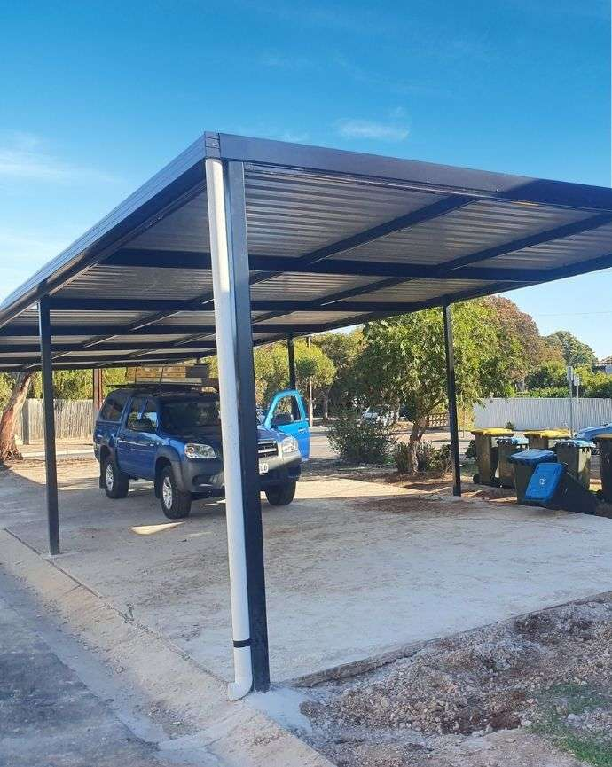

# Image Guide for Service Cards

## 📁 Folder Structure Created

```
Landing-Page-V0.1/
├── images/
│   ├── services/          # Service card images (80x80px minimum)
│   └── placeholders/      # Temporary placeholder images
```

## 🎯 Image Requirements

### Technical Specifications:
- **Format**: JPG or PNG (JPG recommended for smaller file size)
- **Minimum Size**: 80x80 pixels (exact size for best quality)
- **Recommended Size**: 160x160 pixels (for high-DPI displays)
- **Aspect Ratio**: 1:1 (square)
- **File Size**: Under 50KB per image (optimized)
- **Color**: Full color, professional quality

### Image Style Guidelines:
- ✅ Professional, clear, high-quality photos
- ✅ Well-lit with good contrast
- ✅ Shows the actual service/work being done
- ✅ Can include tools, equipment, or finished work
- ❌ Avoid blurry or pixelated images
- ❌ Avoid stock photos with watermarks
- ❌ Avoid overly busy backgrounds

## 📸 Images Needed by Service Page

### 1. **handyman-service.html** (WZS Trading)
- `carport-installation.jpg` - Photo of carport or steel work
- `electrical-wiring.jpg` - Electrical panel or wiring work
- `gate-motor-repair.jpg` - Gate motor or automated gate
- `emergency-repairs.jpg` - General handyman tools or repair work

### 2. **kroot-online.html** (Web Design)
- `web-design.jpg` - Laptop with website design
- `professional-website.jpg` - Desktop showing modern website
- `seo-optimization.jpg` - Analytics dashboard or search results
- `branding-services.jpg` - Logo design or brand materials

### 3. **home-renovations.html** (Borderline Renovations)
- `home-renovation.jpg` - House renovation in progress
- `interior-design.jpg` - Modern interior space
- `quality-materials.jpg` - Building materials or tools
- `expert-team.jpg` - Construction team or workers

### 4. **tall-guy-tree-service.html** (Tree Service)
- `tree-removal.jpg` - Tree cutting or removal work
- `tree-trimming.jpg` - Tree trimming equipment or pruned tree
- `stump-grinding.jpg` - Stump grinder or ground stump
- `safety-equipment.jpg` - Safety gear or professional arborist

### 5. **vaal-skip-hire.html** (Waste Removal)
- `skip-hire.jpg` - Skip bin or waste container
- `waste-removal.jpg` - Waste collection vehicle
- `clean-service.jpg` - Clean site after waste removal
- `fast-delivery.jpg` - Skip delivery truck

## 🌐 Free Image Sources (Royalty-Free)

### Recommended Sites:
1. **Unsplash** (https://unsplash.com)
   - High-quality, free images
   - No attribution required
   - Search terms: "construction", "handyman", "tools", "renovation"

2. **Pexels** (https://pexels.com)
   - Free stock photos
   - Commercial use allowed
   - Search terms: "electrician", "gate", "carport", "building"

3. **Pixabay** (https://pixabay.com)
   - Free images and vectors
   - No attribution required
   - Search terms: "home repair", "tree cutting", "skip bin"

4. **Freepik** (https://freepik.com) - Free tier available
   - Requires attribution for free images
   - Professional quality

### Search Terms by Service:

**Handyman Services:**
- "handyman tools"
- "electrical panel"
- "gate motor"
- "carport construction"
- "home repair"

**Web Design:**
- "laptop coding"
- "web design"
- "digital marketing"
- "website mockup"
- "responsive design"

**Home Renovations:**
- "home renovation"
- "interior design"
- "house construction"
- "kitchen remodel"
- "painting walls"

**Tree Service:**
- "tree cutting"
- "arborist"
- "chainsaw work"
- "tree removal"
- "stump grinding"

**Skip Hire:**
- "waste container"
- "skip bin"
- "rubbish removal"
- "construction waste"
- "dumpster"

## 🔧 How to Add Images

### Step 1: Download Images
1. Visit Unsplash/Pexels/Pixabay
2. Search for relevant terms (see above)
3. Download images in JPG format
4. Rename them according to the list above

### Step 2: Optimize Images
Use one of these free tools to resize/compress:

**Online Tools:**
- **TinyPNG** (https://tinypng.com) - Compress images
- **Squoosh** (https://squoosh.app) - Resize & compress
- **iLoveIMG** (https://iloveimg.com/resize-image) - Batch resize

**Settings:**
- Resize to 160x160 pixels
- Quality: 80-85%
- Format: JPG

### Step 3: Place in Folder
Copy optimized images to:
```
C:\Users\ruant\Desktop\Landing Page\Landing-Page-V0.1\images\services\
```

### Step 4: Verify
Open each service page in browser to verify images load correctly.

## ✨ Smart Fallback System

The pages are set up with a **smart fallback system**:
- If image loads: Shows the professional image
- If image is missing: Automatically falls back to the emoji icon
- No broken image icons will appear!

**How it works:**
```html

<div class="service-icon" style="display:none">🔧</div>
```

## 🎨 Quick Start with Placeholder Images

If you want to test the layout before getting real images, you can:

1. Create simple colored placeholder images using:
   - **Placeholder.com**: https://placeholder.com/
   - Example URL: `https://via.placeholder.com/160x160/f5cb5c/242423?text=Carport`

2. Or download free placeholder images from:
   - **LoremFlickr**: https://loremflickr.com/160/160/construction

3. Save them with the correct filenames in `/images/services/`

## 📋 Quick Checklist

- [ ] Create `/images/services/` folder ✅ (Already done)
- [ ] Download 20 images total (4 per service page)
- [ ] Optimize all images to 160x160px, under 50KB each
- [ ] Rename with correct filenames
- [ ] Copy to `/images/services/` folder
- [ ] Test each page in browser
- [ ] Verify all images load properly
- [ ] Check mobile responsiveness

## 🚀 Next Steps

1. **Start with handyman-service.html** - Get 4 images for this page
2. **Test in browser** - Make sure images look good
3. **Apply same CSS/HTML to other pages** - I'll help with this
4. **Repeat for all 5 service pages**

## 💡 Pro Tips

1. **Use Canva** (free) to create custom images with your brand colors
2. **Take your own photos** of actual work for authenticity
3. **Keep backups** of original high-res images
4. **Compress before upload** - Faster page load times
5. **Use descriptive alt text** - Better for SEO and accessibility (already done!)

## 📞 Need Help?

If images aren't loading:
1. Check file names match exactly (case-sensitive)
2. Verify images are in correct folder
3. Check file extensions (.jpg not .jpeg)
4. Clear browser cache (Ctrl + F5)
5. Open browser console (F12) to see errors

---

**Current Status**:
- ✅ CSS updated with image support
- ✅ handyman-service.html updated with image structure
- ⏳ Need to update remaining 4 service pages
- ⏳ Need to download/add actual images
